# Realtime Video Chat - App Workflow

## User Journey Flow

```mermaid
flowchart TD
    START[User öffnet App] --> FORM[Join Form<br/>Name + Room ID eingeben]
    FORM --> ROUTE[Navigation zu /room/ROOMID?name=USERNAME]
    ROUTE --> VALIDATE{Parameter<br/>validieren}
    VALIDATE -->|❌ Invalid| ERROR[Error Page<br/>Zurück zur Startseite]
    VALIDATE -->|✅ Valid| PERMISSION[Media Permission Request]
    
    PERMISSION --> MEDIA_CHECK{Kamera/Mikro<br/>Berechtigung?}
    MEDIA_CHECK -->|❌ Verweigert| PERMISSION_ERROR[Permission Error<br/>Retry oder Home]
    MEDIA_CHECK -->|✅ Gewährt| VIDEO_ROOM[VideoRoom Component]
    
    VIDEO_ROOM --> SOCKET[Socket Connection<br/>via SocketManager]
    SOCKET --> JOIN_ROOM[join-room Event<br/>an Server]
    JOIN_ROOM --> WEBRTC[WebRTC Peer<br/>Connections erstellen]
    WEBRTC --> ACTIVE[🎥 Aktiver Video Call]
    
    ACTIVE --> LEAVE[Leave Room Button]
    LEAVE --> CLEANUP[Media Stream Cleanup]
    CLEANUP --> START
```


## System Architecture
```mermaid
graph TB
    subgraph "Frontend (Next.js)"
        A[Home Page /]
        B[Room Page /room/[id]]
        C[VideoRoom Component]
        D[useWebRTC Hook]
        E[SocketManager Singleton]
    end
    
    subgraph "Server (Socket.IO)"
        F[HTTP Server]
        G[Socket.IO Server]
        H[User State Map]
        I[Room State Map]
        J[Redis Session Store]
    end
    
    subgraph "WebRTC"
        K[SimplePeer Library]
        L[STUN/TURN Servers]
        M[Media Streams]
    end
    
    A --> B
    B --> C
    C --> D
    D --> E
    E <--> G
    G --> H
    G --> I
    G <--> J
    D <--> K
    K <--> L
    K --> M
```

## Server State Management


## WebRTC Connection Flow

```mermaid
sequenceDiagram
    participant U1 as User 1 (bereits im Room)
    participant S as Server
    participant U2 as User 2 (neu joinent)
    
    U2->>S: join-room { room, name }
    S->>U1: user-joined { id, name, mediaState }
    S->>U2: room-users [{ id, name, mediaState }]
    
    Note over U1,U2: WebRTC Signaling
    U1->>U1: createPeer(U2.id, initiator: true)
    U2->>U2: createPeer(U1.id, initiator: false)
    
    U1->>S: offer { to: U2.id, offer }
    S->>U2: offer { from: U1.id, offer }
    
    U2->>S: answer { to: U1.id, answer }
    S->>U1: answer { from: U2.id, answer }
    
    U1->>S: ice-candidate { to: U2.id, candidate }
    S->>U2: ice-candidate { from: U1.id, candidate }
    
    Note over U1,U2: 🎥 Video Connection Established
```

